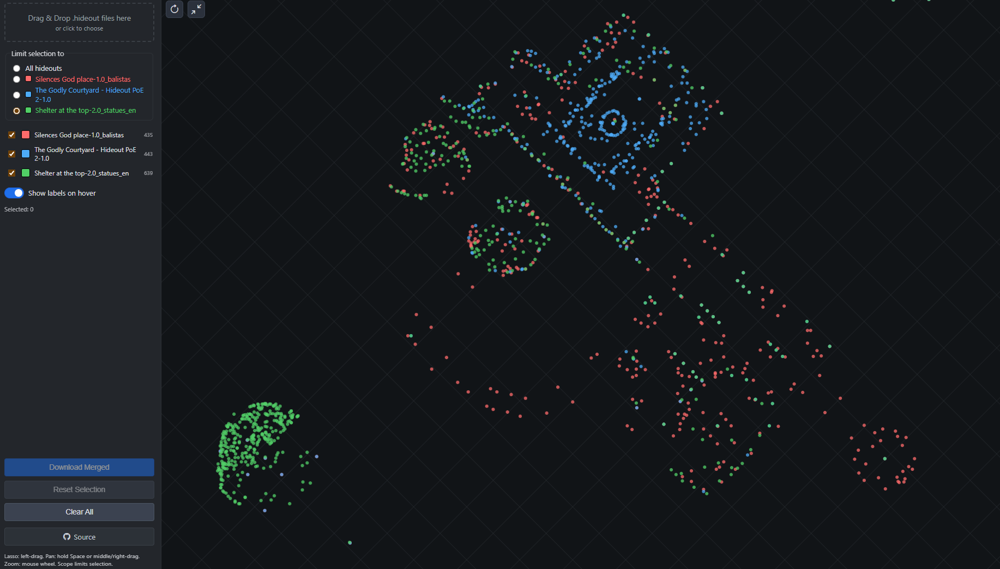

# Path of Hideout — PoE Hideout Viewer & Merger

A lightweight React web app to visualize multiple Path of Exile hideout files, lasso‑select doodads across them, and export a selectively merged `.hideout` file.

## Other Projects

- [Path of Trading](https://github.com/drandarov-io/path-of-trading) — PoE 2 currency trading helper.

## Showcase



## Features

- Drag & drop or file‑picker import of `.hideout` JSON files
- Per‑hideout visibility and color
- Selection scope: select across all or limit to one hideout
- Lasso selection and click‑to‑toggle selection
- Pan, zoom (wheel), rotate view (45° steps), and fit‑to‑content
- Export merged `.hideout` preserving metadata and removing exact duplicates

## Quick start

If you want to use a hosted version, go to <https://d7v.io/h/poe/hideout/>

```powershell
# Install
npm install

# Develop
npm run dev

# Build (optional)
npm run build
```

Open the app in a browser, then drag & drop `.hideout` files into the sidebar.

## Usage

- Import: Drag & drop into the “Drop .hideout files here” zone or click to choose files. The app requires all imported files to share the same `hideout_hash` for consistent merging.
- Sidebar:
  - Toggle each hideout’s visibility.
  - “Limit selection to” can be set to All or a specific hideout.
- Canvas controls:
  - Lasso: left‑drag to draw a selection polygon.
  - Click a doodad to toggle its selection.
  - Pan: hold Space or use middle/right‑drag.
  - Zoom: mouse wheel (scroll down zooms out).
  - Rotate: top‑left circular button (+45° per click).
  - Fit: top‑left “contract” button to fit content.
- Export: Click “Download Merged” to save a `.hideout` with only the selected doodads.

## Notes

- Exact duplicates (same `name`, `hash`, `x`, `y`, `r`, `fv`) are removed on export.
- Metadata (`version`, `language`, `hideout_name`, `hideout_hash`) is preserved in the merged file.
- The viewer flips Y visually to match PoE’s coordinate system; file values are kept as‑is.

## Hideout file structure

Hideout files are plain JSON with a small header and a list of doodads.

```json
{
  "version": 1,
  "language": "English",
  "hideout_name": "Plateau of the Gods Hideout",
  "hideout_hash": 59052,
  "doodads": {
    "Stash": {
      "hash": 3230065491,
      "x": 836,
      "y": 1363,
      "r": 49358,
      "fv": 0
    },
    "Guild Stash": {
      "hash": 139228481,
      "x": 831,
      "y": 1377,
      "r": 58026,
      "fv": 0
    }
  }
}
```

## Privacy

All processing runs locally in your browser; files are not uploaded.
